Hello
---

--- 
<!-- column_layout: [1,1] -->
<!-- column: 0 -->

<!-- column: 1 -->
<!-- new_lines: 7 -->
#  Audio Engineer -> Software Engineer
<!-- new_line -->
<!-- new_line -->
#  Obsessed with Building
<!-- new_line -->
<!-- new_line -->
#  Love Coffee

<!-- end_slide -->
<!-- pause -->
```python +no_background
██████╗ ██╗   ██╗████████╗          ██╗    ██╗██╗  ██╗██╗   ██╗
██╔══██╗██║   ██║╚══██╔══╝          ██║    ██║██║  ██║╚██╗ ██╔╝
██████╔╝██║   ██║   ██║             ██║ █╗ ██║███████║ ╚████╔╝ 
██╔══██╗██║   ██║   ██║             ██║███╗██║██╔══██║  ╚██╔╝  
██████╔╝╚██████╔╝   ██║██╗██╗██╗    ╚███╔███╔╝██║  ██║   ██║   
╚═════╝  ╚═════╝    ╚═╝╚═╝╚═╝╚═╝     ╚══╝╚══╝ ╚═╝  ╚═╝   ╚═╝   
                                                               
```
<!-- speaker_note: Obvously not for front end -->
<!-- pause -->
```markdown +no_background {all|1|3|5|7|all}
1. Better concurrency support

2. Faster single thread performance

3. Lower memory overheads

4. Lower running costs
```
<!-- speaker_note: These are reasons for many languages... -->
<!-- alignment: center -->
<!-- end_slide -->
## Simplicity...

--- 

You have a few options...
<!-- pause -->
<!-- alignment: center -->
<!-- column_layout: [1, 1] -->
<!-- column: 0 -->
Java
```java +line_numbers
public class HelloWorld {
    public static void main(String[] args) {
        System.out.println("Hello, World!");
    }
  }
```
<!-- pause -->
C#
```java +line_numbers
using System;

public class Program {
    public static void Main(string[] args) {
        Console.WriteLine("Hello, World!");
    }
}
```
<!-- pause -->
<!-- column: 1 -->
C++
```c +line_numbers
#include <iostream> 

int main() {
    std::cout << "Hello World!" << std::endl; 
    return 0;
}
```
<!-- pause -->
Rust
```rust +line_numbers
fn main() {
    println!("Hello, world!");
}
```
^ Borrow checker & async complexity overhead
<!-- pause  -->
<!-- alignment: center -->
<!-- end_slide -->
## Clear is better than Clever

---

<!-- end_slide -->
Syntax
---
---
<!-- column_layout: [1, 1] -->
<!-- alignment: center -->
<!-- column: 0 -->
TS
```typescript +line_numbers
export function sayHello(name: string) {
  console.log("Hello", name);
}
```
<!-- column: 1 -->
GO
```go +line_numbers
func SayHello(name string) {
  fmt.Println("Hello", name)
}
```
<!-- pause -->
<!-- column: 0 -->
```typescript +line_numbers
export interface foo {
  numA: number;
  numB: number;
}

export function sumFoos(foos: foo[]) {
  let sum = 0

  for (let foo of foos) {
    sum += foo.numA
    sum += foo.numB
  }
  return sum
}
```
<!-- column: 1 -->
```go +line_numbers
package hello

type Foo struct {
	numA int
	numB int
}

func SumFoos(foos []Foo) int {
	sum := 0

	for _, foo := range foos {
		sum += foo.numA
		sum += foo.numB
	}
	return sum
}
```
<!-- end_slide -->
<!-- alignment: center -->
Standard Library and Tooling
---
<!-- alignment: left -->
## The Full Package
---
<!-- speaker_note: Go has a philosophy of no dependencies -->
<!-- column_layout: [1, 1] -->
<!-- column: 1 -->
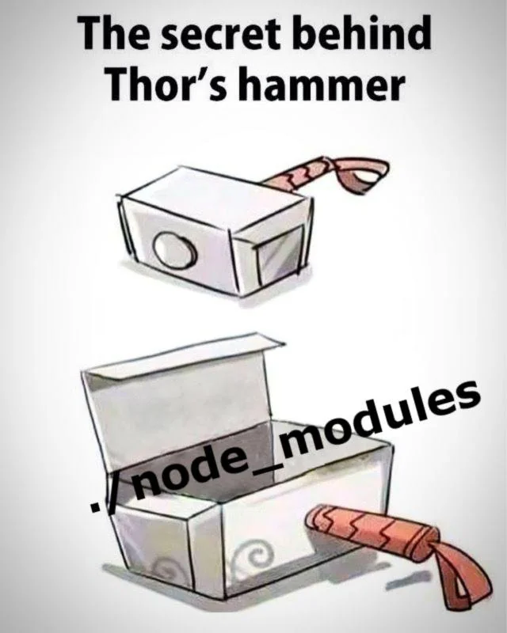
<!-- column: 0 -->
### Tooling
- go build: compiles to a single binary, no runtime needed.
- go's GC: Has garbage collection
- go fmt: highly opinionated (unconfigurable) formatting built in. 
- go mod: dependency management 
<!-- pause -->
### Networking
- Full featured http routing, middleware and file serving 
- TCP, UDP, SMTP, etc
<!-- pause -->
### Testing, Profiling & Benchmarking
- Comes with a full testing suite and coverage tools
- Performance and memory profiling with Pprof
<!-- pause -->
### Type Safety
- Simple and powerful type system
- Build right into the compiler and LSP 
<!-- pause -->
### Plus more...
- Powerful string/html templating
- Full cryptography suite
<!-- end_slide -->
<!-- alignment: center -->
Error Handling
---
<!-- alignment: left -->
## Errors Are Values
---
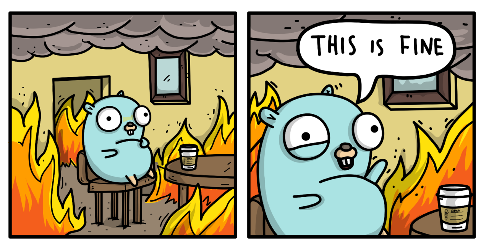
```go +line_numbers {all|2-5}
res, err := SomeDangerousFunction()
if err != nil {
  //... Handle the error
  log.Fatalf("failed to run dangerous: %v", err)
}
```
<!-- speaker_note: locality of behaviour -->
<!-- end_slide -->
<!-- alignment: center -->
Error Handling
---
<!-- alignment: left -->
## Errors Are Values
---
```go 
// The error built-in interface type is the conventional interface for
// representing an error condition, with the nil value representing no error.
type error interface {
	Error() string
}
```
<!-- pause -->
```go +line_numbers {all|5|all}
type CustomError struct {
  message string
}

func (e *CustomError) Error() string {
	return fmt.Println("this is a custom error: ", e.message)
}
```
<!-- end_slide -->
<!-- alignment: center -->
Error Handling
---
<!-- new_lines: 7 -->
```go +line_numbers {all|2|3-7|9-10|13-16|all}
for {
  msgType, msg, err := conn.ReadMessage()
  if err != nil {
    if websocket.IsCloseError(err, websocket.CloseNormalClosure, websocket.CloseGoingAway) {
      log.Printf("client disconnected: %v", err)
      return 
    }

    log.Printf("read error: %v", err)
    continue
  }

  if err := handleMessage(msgType, msg); err != nil {
    log.Printf("failed to handle message: %v", err)
    continue
  }
}
```
<!-- end_slide -->
<!-- alignment: center -->
Concurrency
---
<!-- alignment: left -->
---

<!-- column_layout: [1, 99] -->
<!-- column: 0 -->
#### Sequential
<!-- column: 1 -->
```go +line_numbers {all|1|6-8|all}
	files, err := os.ReadDir(inDir)
	if err != nil {
		panic(err)
	}

	for _, f := range files {
		resizeImg(f)
	}
```
<!-- pause -->
<!-- column: 0 -->
<!-- new_lines: 9 -->
#### Parallel.. However...

<!-- column: 1 -->
```go +line_numbers {all|2|all}
	for _, f := range files {
		go resizeImg(f)
	}
```
<!-- pause -->
<!-- column: 0 -->
<!-- new_lines: 5 -->
#### Parallel
<!-- column: 1 -->
```go +line_numbers {all|1|4|5|7|all}
	wg := sync.WaitGroup{}

	for _, f := range files {
		wg.Add(1)
		go resizeImg(f, &wg)
	}
	wg.Wait()
```
<!-- end_slide -->
<!-- alignment: center -->
Concurrency
---
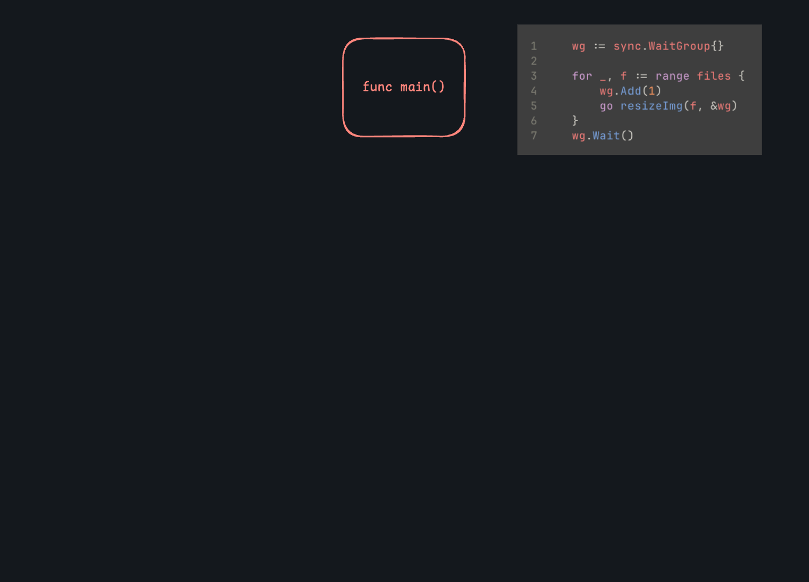
<!-- end_slide -->
Concurrency
---
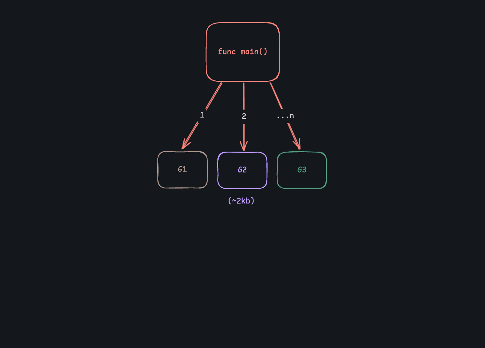
<!-- end_slide -->
<!-- alignment: center -->
Concurrency
---
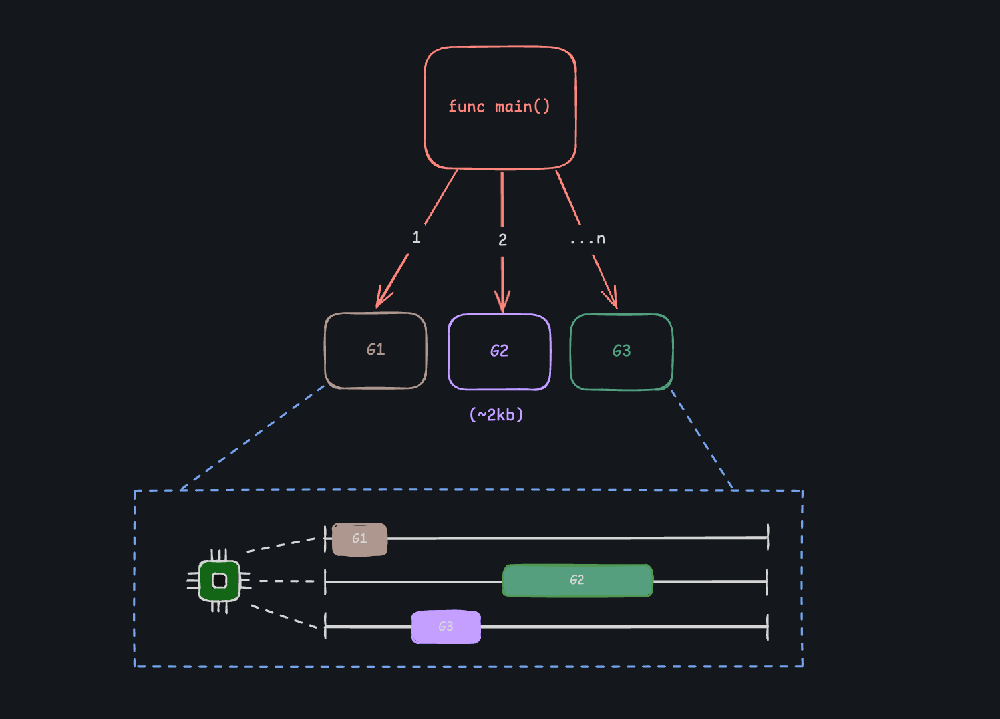
<!-- end_slide -->
<!-- alignment: center -->
Concurrency
---
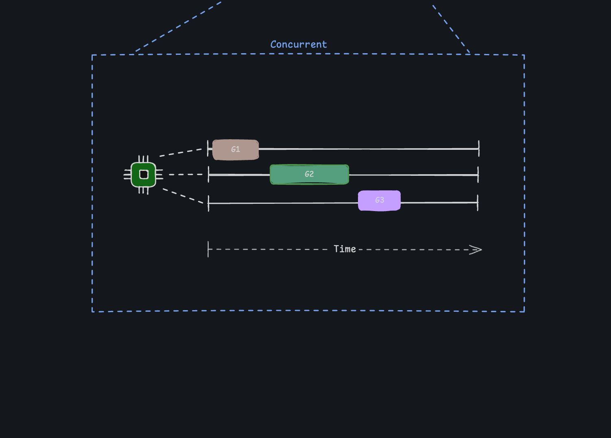
<!-- end_slide -->
<!-- alignment: center -->
Concurrency
---
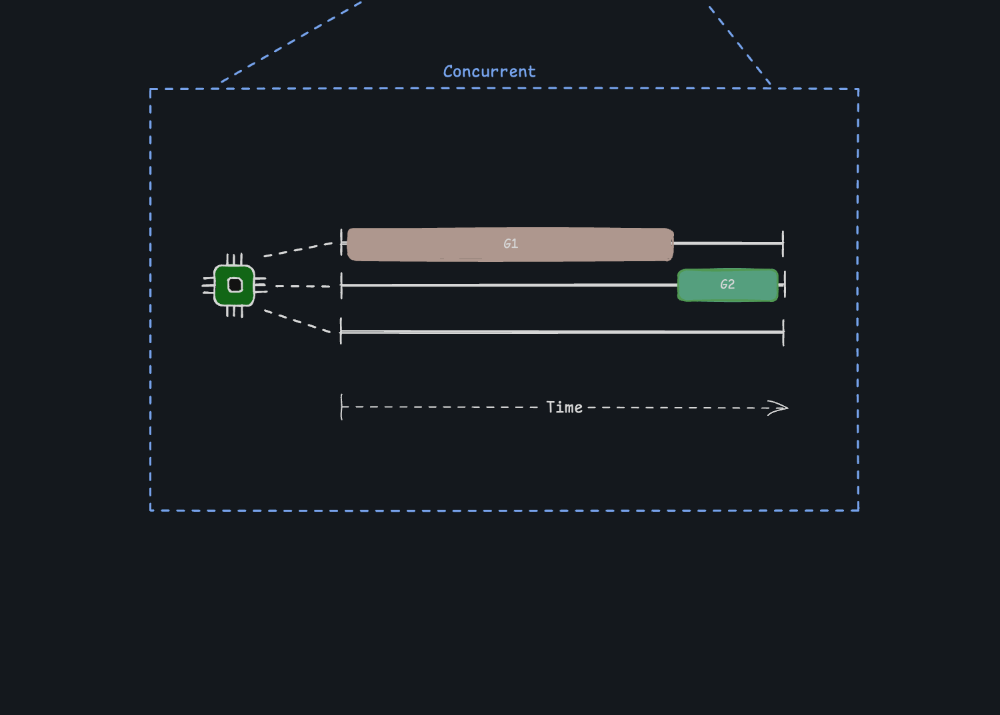
<!-- end_slide -->
<!-- alignment: center -->
Concurrency
---
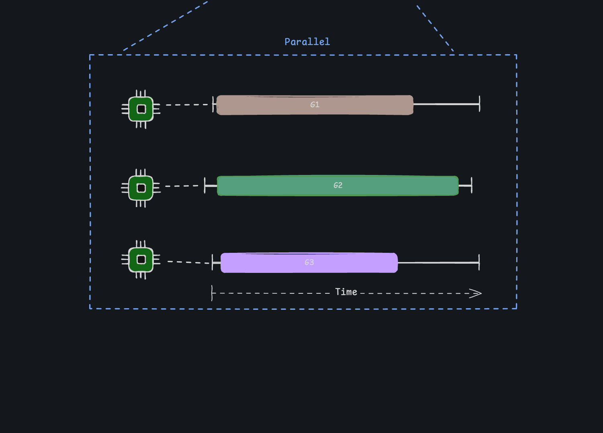
<!-- end_slide -->
<!-- alignment: center -->
Concurrency
---
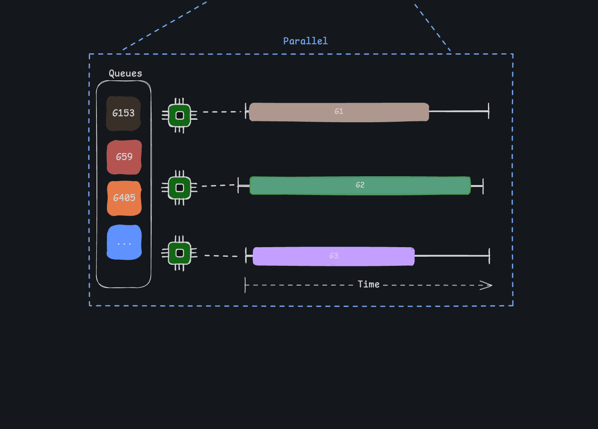
<!-- end_slide -->
<!-- alignment: center -->
Concurrency
---
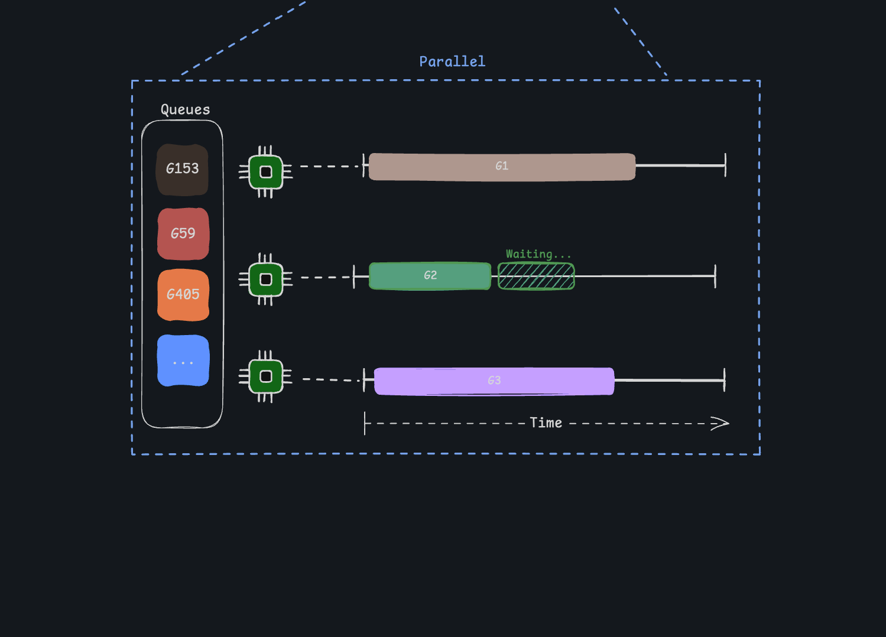
<!-- end_slide -->
<!-- alignment: center -->
Concurrency
---
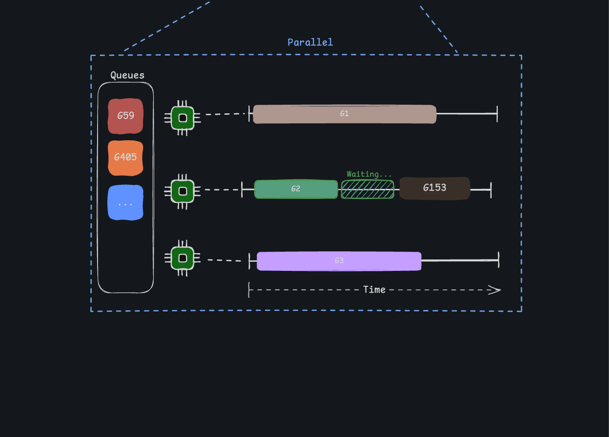
<!-- end_slide -->
Concurrency
---
<!-- alignment: left -->
---
##### Don't communicate by sharing memory, share memory by communicating.
<!-- column_layout: [1,1] -->
<!-- column: 0 -->
<!-- pause -->
```go +line_numbers {all|1|5}
	ch := make(chan int64)
    res := make([]int64, 0, len(files))

	for _, f := range files {
		go resizeImgWithChannel(f, ch)
	}

	for range len(files) {
		res = append(res, <-ch)
	}
```
```go +line_numbers {all}
func resizeImgWithChannel(path os.DirEntry, result chan int64) {
  // Process the image...

  result <- newImg.Size()
}
```
<!-- end_slide -->
Concurrency
---
<!-- alignment: left -->
---
##### Don't communicate by sharing memory, share memory by communicating.
<!-- column_layout: [1,1] -->
<!-- column: 0 -->
```go +line_numbers {3}
	ch := make(chan int64)
    res := make([]int64, 0, len(files))

	for _, f := range files {
		go resizeImgWithChannel(f, ch)
	}

	for range len(files) {
		res = append(res, <-ch)
	}
```
```go +line_numbers {4}
func resizeImgWithChannel(path os.DirEntry, result chan int64) {
  // Process the image...

  result <- newImg.Size()
}
```
<!-- end_slide -->
Concurrency
---
<!-- alignment: left -->
---
##### Don't communicate by sharing memory, share memory by communicating.
<!-- column_layout: [1,1] -->
<!-- column: 0 -->
```go +line_numbers {all}
	ch := make(chan int64)
    res := make([]int64, 0, len(files))

	for _, f := range files {
		go resizeImgWithChannel(f, ch)
	}

	for range len(files) {
		res = append(res, <-ch)
	}
```
```go +line_numbers {all}
func resizeImgWithChannel(path os.DirEntry, result chan int64) {
  // Process the image...

  result <- newImg.Size()
}
```
<!-- end_slide -->
<!-- alignment:  center -->
Thanks
---
---
<!-- column_layout: [1,1,1] -->
<!-- column: 0 -->

<!-- column: 1 -->
Questions?
---
<!-- column: 2 -->
# Reach out and say Hi!

# Check out this repo:

